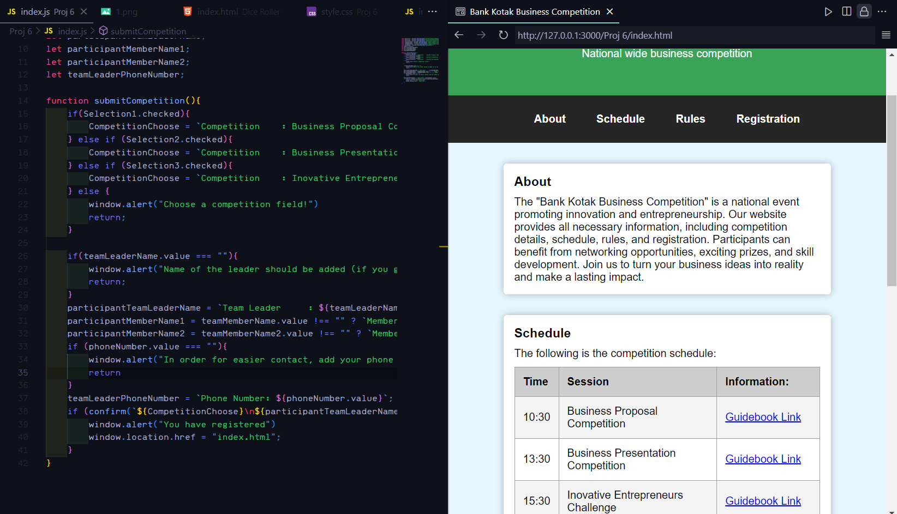

# [Competition_Landing_Page] - Website Project

## Overview
This website is one of my fruits before entering the 2nd semester, i learn some Javascript and abit of HTML + CSS training to make this as a personal project to bring back the knowledge i about UI in Highschool & learning Javascript through YouTube videos.

## Purpose
- Refresh my minds about HTML + CSS
- Learning Javascript to prepare myself for the 2nd semester

## Tools
- HTML5
- CSS (Vanilla)
- JS (Vanilla)

## Screenshot

## Live Demo
[Click here](https://joelc-code.github.io/Competition_Landing_Page/)
